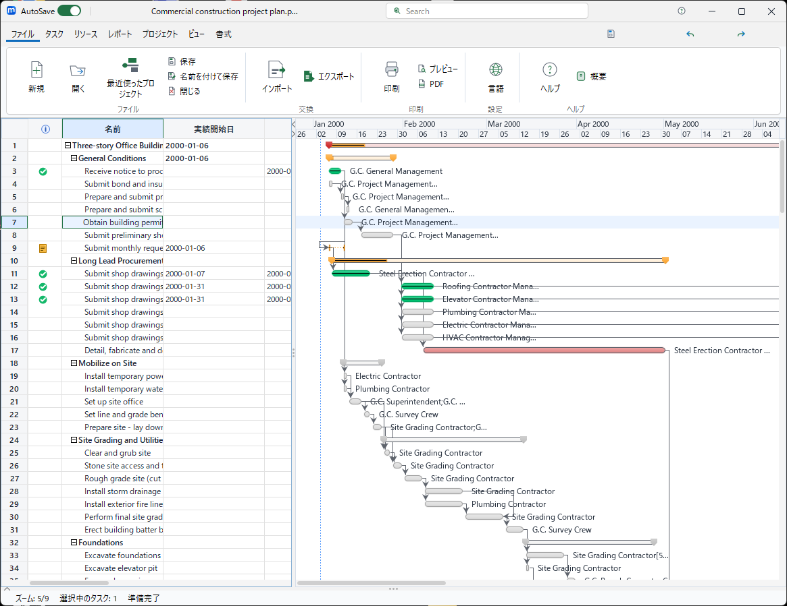

# SwingRibbonUI

`SwingRibbonUI` is a small, dependency-free Office-style ribbon component for Java Swing.
It deliberately does not depend on FlatLaf, an icon library, a resource format, or an application's command framework.

## Visual reference



This is a direct capture of the microProject application window that informed the
ribbon design. It contains the application only—no desktop, taskbar, or unrelated
windows—and is included as a high-fidelity visual reference rather than a generated
mockup.

## Features

- Immutable tab, band, and command metadata
- Host-provided Swing `Action`, icon, localization, and theme integration
- Contextual tabs
- Responsive command groups
- Always-show, tabs-only, and auto-hide display modes
- Tab context menu for expand/collapse

## Usage

```java
var document = new RibbonBand("document", "Document", List.of(
    new RibbonItem("open", "Open", openIcon, RibbonItem.Size.LARGE),
    new RibbonItem("save", "Save", saveIcon, RibbonItem.Size.LARGE)));

var ribbon = new SwingRibbon(List.of(
    new RibbonTab("file", "File", List.of(document))),
    commandId -> actions.get(commandId));

frame.add(ribbon, BorderLayout.NORTH);
```

The component does not mutate a document model or post Undo edits. A host command owns those responsibilities.

## Build

Requires JDK 25 or newer.

```powershell
.\gradlew.bat test
.\gradlew.bat generatePreview
```

`generatePreview` renders the component off screen. It never captures the desktop.

## License

MIT. See [LICENSE](LICENSE).
