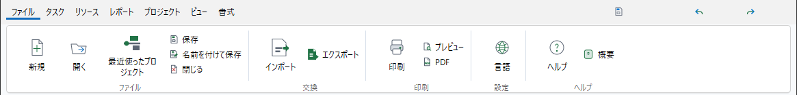

# SwingRibbonUI

`SwingRibbonUI` is a small, dependency-free Office-style ribbon component for Java Swing.
It deliberately does not depend on FlatLaf, an icon library, a resource format, or an application's command framework.

## Visual reference



This is a pixel-preserving crop of the microProject application ribbon, from the
tab row through the command bands. It contains no title bar, desktop, taskbar, or
unrelated windows, and is included as a high-fidelity visual reference rather than
a generated mockup.

## Features

- Immutable tab, band, and command metadata
- Host-provided Swing `Action`, icon, localization, and theme integration
- Normal, toggle, drop-down, and split-button command controls
- Large, medium, and compact command sizing with icon-over-label large commands
- Optional application header with AutoSave control, quick-access actions, title, and search field
- Contextual tabs
- Always-show, tabs-only, and auto-hide display modes
- Tab context menu for expand/collapse

## Usage

```java
var document = new RibbonBand("document", "Document", List.of(
    new RibbonItem("open", "Open", openIcon, RibbonItem.Size.LARGE),
    new RibbonItem("save", "Save", saveIcon, RibbonItem.Size.LARGE)));

var ribbon = new SwingRibbon(List.of(
    new RibbonTab("file", "File", List.of(document))),
    commandId -> actions.get(commandId));

frame.add(ribbon, BorderLayout.NORTH);
```

The component does not mutate a document model or post Undo edits. A host command owns those responsibilities.

For the application title/quick-access/search row, compose the optional header above the ribbon:

```java
var header = new RibbonApplicationHeader(
    "Commercial construction project plan",
    autoSaveAction, List.of(saveAction, undoAction, redoAction), searchAction,
    new DefaultRibbonTheme());
frame.add(header, BorderLayout.NORTH);
```

Use `RibbonControlKind.TOGGLE`, `DROP_DOWN`, or `SPLIT_BUTTON` with menu entries to model
their Office-style interaction. The host supplies the localized labels, icons, and `Action`
implementations, including selection, enablement, and persistence semantics.
`AUTO_HIDE` is host-controlled: call `reveal()` when your window decides that
the ribbon should become visible again.

## Build

Requires JDK 25 or newer.

```powershell
.\gradlew.bat test
.\gradlew.bat generatePreview
```

`generatePreview` renders the component off screen. It never captures the desktop.

## License

MIT. See [LICENSE](LICENSE).
